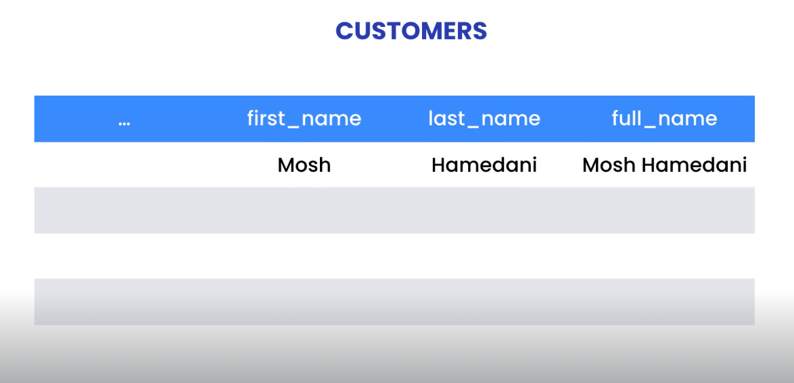

## Designing Databases

-   **Data Modelling**
    -   Is the process of creating a model , for the data you want to store in a database
    -   4 steps to create a model
        -   **Understand the Requirements**: better understanding of the business requirements, the better we can come up with a solution. to understand the requirements you need to talk to business stakeholders, domain experts, look to existing forms, documents spreadsheet etc.
        -   **Build a Conceptual Model**: This involves identifying the entities or concepts in the business and relationship between each other. Conceptual Model is just a visual representation of these concepts.
        -   **Build Logical Model**: Is an abstract data model that is independent of the database technology, it just show the tables and columns that we need
        -   **Build Physical Model**: Physical model is the implementation of a logical model for a particular database technology, so we have the exact data types supported by database, the default values of each column, primary keys, stores procedure, views, etc.
-   **Conceptual Model**

    -   Conceptual Model represent the entities and their relationship with each other.
    -   There are two ways to represent entities:
        -   ER: Entity Relationship, used for data modeling
        -   UML: Unified Modeling Language
    -   Entities is like people, locations, events...
    -   Data modeling is an iterative process, you need to go back and forth between the model and requirements and keep refining until come up with a good model design.

-   **Logical Model**

    -   In logical model we specify each attribute data type like string, integer, float, date.
    -   Logical model id independent from database technology.
    -   Types of relationship between entities:
        -   one-to-one
        -   one-to-many
        -   many-to-many

-   **Physical Model**

    -   Physical model is the implementation of the logical model for a specific database technology.
    -   EER Diagram is a short for Enhanced Entity Relationship
    -   Tables convention name we can use plural or singular name

-   **Primary Keys**

    -   Primary key column is uniquely identifies each record within a table.
    -   Primary key must be auto increment, so we don't have to worry about uniqueness of values.

-   **Foreign Keys**
    -   When we add a relationship between two tables one end called the parent or the primary key and the other end called child or the foreign key table.
    -   To add a relationship click on 1:n button and select the child table then the parent table, MySQL will automatically add a new column called `[parentTable]_[primaryKey]` e.g. `students_student_id`
-   **Foreign Key Constrains**

    -   When we have a foreign key on a table we should always set the constrains on that foreign key.
    -   Foreign keys basically protect our data from getting corrupted.
    -   Constrains are:
        -   On Update: what will happened when the primary key gets updated
        -   On Delete: what will happened when the primary key gets deleted
    -   Constrains Options:
        -   RESTRICT: Mean reject the updated or delete from happening
        -   CASCADE: Mean update all records in child table when the primary key in parent table updated or deleted
        -   SET NULL: Mean set all the foreign keys for that particular primary key not null in child table, so we will end up with no parent for the foreign key, so this record called **orphan record**
        -   NO ACTION: Is like RESTRICT

-   **Normalization**

    -   Normalization is the process of reviewing our design and making sure it follows a few predefined rules that prevent data duplication.
    -   There are basically 7 rules, also called 7 normal forms, and each rule assumes that we have applied the previous rules

-   **First Normal Form (1NF)**

    -   1NF says each cell in a row should have a **single value**, and cannot have repeated columns, e.g. tags in courses table it stores multiple values in one column separated with a comma and what if the tag have column

-   **Link Tables**

    -   In relational databases we don't have many-to-many relationships, we only have one-to-one or one-to-many
    -   To implement many-to-many relationship between two tables we need to create a new table called length table that have a composite primary keys.

-   **Second Normal Form (2NF)**
    -   Second Normal Form says each table should describe one entity, and every column in that table should describe that entity.
    -   The image below shows the orders table with order_id, date, and customer_name attributes. order_id and date describes the order and belongs to it, but the customer name describes the customer not an order.
    -   The first problem with this design is wasting space because the same customer repeated multiple times
    -   The second problem the update will painful.
    -   The solution is put the customer information in a separated table and refer to it by foreign key.So we have a single place to update the customer details.


-   **Third Normal Form (3NF)**
    -   The entity is second normal form
    -   A column in a table should not be derived from other columns
        -   _Example 1:_ Look to the invoices table below, we agree that the balance can be calculated by subtracting invoices_total from payment_total, so the balance can be derived from these two columns, so we say balance **dependent**on these two columns, so if any value of these two columns changes the balance must be recalculated. What if we forget to update the balance?. So the data will not be consistent. So as the 3rd rule says we should not relay on the balance column, so we must drop it.
        -   _Example 2:_ Look to the customers table, it violates the third rule, the full name can be calculated be concatenating the first name and last name, so we can drop it.




-   **Forward Engineering a Model**

    -   Convert the model into a real physical database.
    -   In EER Diagram page, select Database -> Forward Engineer

-   **Synchronizing a Model with a Database**

    -   We add the model to database, what if we want to add a new table? or modify one of the existing ones?, we can do that with the edit mode, but it only works on local machine.
    -   But what if we want to replicate these changes on staging, development, testing or production database ?
    -   We can do that but editing thr EER Diagram and synchronizing it with other databases.
    -   From EER diagram page, select Database -> Synchronize Model

-   **Reverse Engineering a Database**

    -   What if we want to change a database that does not have a model?
    -   First ensure that the No EER Model opened, because it will add the new model to the opened one.
    -   Select Database option -> Revers Engineer

-   **Creating Databases**

    -   Create database
        -   `CREATE DATABASE IF NOT EXISTS sql_store2;`
    -   Drop database
        -   `DROP DATABASE IF EXISTS sql_store2;`

-   **Creating Tables**

```SQL
USE sql_store2;
CREATE TABLE IF NOT EXISTS customers
(
	customer_id INT PRIMARY KEY AUTO_INCREMENT,
    first_name VARCHAR(50) NOT NULL,
    points INT NOT NULL DEFAULT 0,
    email VARCHAR(255) NOT NULL UNIQUE
);
```

-   **Altering Tables**

```SQL
ALTER TABLE customers
	ADD last_name VARCHAR(50) NOT NULL AFTER first_name,
    ADD city VARCHAR(50) NOT NULL,
    MODIFY COLUMN first_name VARCHAR(55) DEFAULT '',
    DROP points;
```

-   **Creating Relations**
    -   After listing all the columns, start to add the relations.

```SQL
CREATE DATABASE IF NOT EXISTS sql_store2;
USE sql_store2;

DROP TABLE IF EXISTS orders; -- Orders table must be dropped before customers, because it rely on customers table.
DROP TABLE IF EXISTS customers;

CREATE TABLE IF NOT EXISTS customers
(
	customer_id INT PRIMARY KEY AUTO_INCREMENT,
    first_name VARCHAR(50) NOT NULL,
    points INT NOT NULL DEFAULT 0,
    email VARCHAR(255) NOT NULL UNIQUE
);


CREATE TABLE orders
(
	order_id 	INT PRIMARY KEY, -- No need to NOT NULL attribute, because the database assume the primary key is not null
    customer_id INT NOT NULL,
    FOREIGN KEY fk_orders_customers (customer_id)-- fk_[child(foreign key table)]_[parent(primary key column)]
		REFERENCES customers (customer_id)
        ON UPDATE CASCADE
        ON DELETE NO ACTION
);
```

-   **Altering Primary/Foreign Keys**

```SQL
ALTER TABLE orders
	ADD PRIMARY KEY (order_id, column_2),
    DROP PRIMARY KEY,  -- NO need to specify the column name
	DROP FOREIGN KEY fk_orders_customers,
    ADD FOREIGN KEY fk_orders_customers (customer_id)
		REFERENCES customers (customer_id)
        ON UPDATE CASCADE
        ON DELETE NO ACTION;
```

-   **Character Sets and Collations**
    -   **Character Sets**
        -   What is a character set? When we store a character like `'abc'` MySQL will convert each character to its numeric representation using a character set
        -   Character set is a table that maps each character to a number.
        -   There are various different character sets out there some of them supports Latin languages, other support Asian languages, and other supports all international languages.
        -   To view all character sets your database support use `SHOW CHARSET` , e.g. utf8 supports all various languages.
    -   **Collations**
        -   What is collation? collation is a bunch of rules that determine how the characters in a given language are sorted, e.g. default collation for utf8 is _utf8_general_ci_, ci mean case insensitive, basically that mean the database treats lowercase and uppercase character the same when it comes to sorting.
    -   **MaxLen**
        -   MaxLen mean how much MySQL reserve for each character, e.g. utf8 reserves 3 bytes for storing each character
        -   Character set can be changed for column, table , or database
