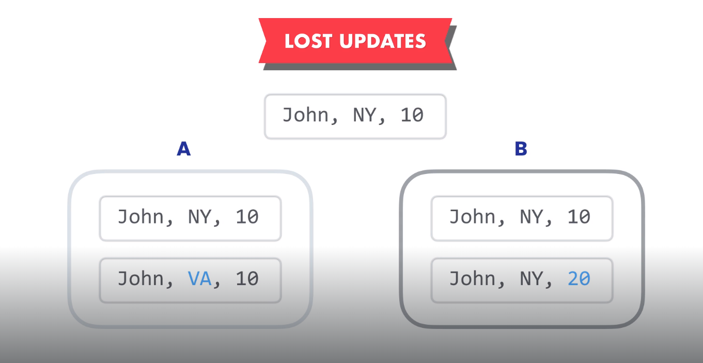
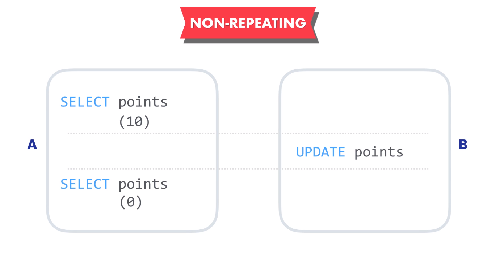
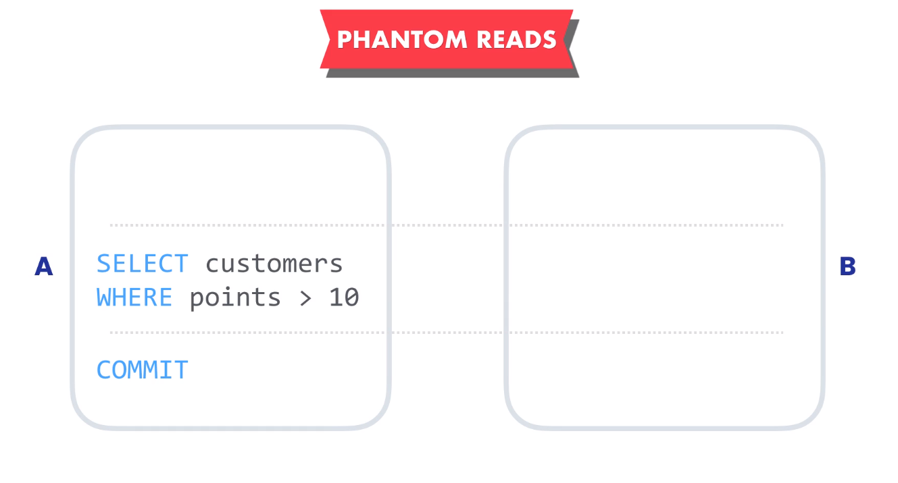

## Transactions

-   **Transactions**

    -   Transaction is a group of SQL statement that represent a single unit of work.
    -   Single unit of work mean all the transaction must be completed successfully or the transaction will fail. e.g. insert an order with order items.

    -   Transaction property (ACID)
        -   **Atomicity**:This mean the transactions are like atom, they unbreakable.Each transaction is a single unit of work no matter how many statement it contains.Either all the statement are completed successfully and the transaction is committee or the transaction is rolled back and all the changes are undone.
        -   **Consistency**: This mean with these transactions our database will always remain in consistent state, e.g. we will not end up with an order without an item
        -   **Isolation**: That mean transactions are isolated or protected from each other transactions if they try to modify the same data, so they can not interfere with each other.If multiple transactions try to modify the same data the rows that are being affected et locked, so only one transaction at a time can update those rows.other transactions have to wait those rows to complete.
        -   **Durability**: That mean once a transaction is committed the changes made by the transaction are permanent, so if you have a power failer or a system crash we are not going to lose the changes.

-   **Creating Transactions**
    -   COMMIT: Apply the changes of a transaction to the database as permanent.
    -   ROLLBACK: Apply the changes only if all queries are successful.

```SQL
START TRANSACTION;

INSERT INTO orders (customer_id, order_date, status)
VALUES(1, '2024-03-17', 1);

INSERT INTO order_items
VALUES (last_insert_id(), 1, 1, 1),
	   (last_insert_id(), 1, 1, 1);

ROLLBACK;
```

-   **Concurrency and Locking**

    -   Concurrency mean that two users or more trying to reach the same record
    -   MySQL will lock the row until the first transaction finish.
    -   Concurrency maybe a problem when one user modifies the data and other users try to retrieve or modify.

-   **Concurrency Problems**

    -   **Lost Updates**
        
        -   This happens when two transactions try to update same data and we do not use locks, in this situation the transaction that commits later will override the changes made by the previous transaction.
        -   Solution is using _Locks_
    -   **Dirty Reads**
        -   This happens when a transaction reads data that hasn't been committed yet
        -   Solution is using a level of isolation around transaction (READ COMMITTED). So the data modified by the transactions is not immediately visible to other transactions, unless it's committed.
    -   **Non-repeatable Reads**
        
        -   During the transaction we read something twice and get different results
        -   If the business logic required to read the most updated value, this would not be a problem, if not and we must read the initial snapshot so we need to increase the isolation level of the transaction with (REPEATABLE READ).
    -   **Phantom Reads**
        
        -   Transaction A queries all customers with points greater than 10, at the same time transaction B updates a customer that not returned with transaction , so now this customer is eligible for the transaction A, but at the time we call the transaction A we did not save that customer.
        -   Solution depends on business logic, but if it critical to include all eligible customers, we must sure there is no transactions are running that will impact our query, so we need to use a level of isolation (SERIALIZABLE).
        -   SERIALIZABLE will guarantee that our transaction will be aware of changes currently being made by other transactions to the data, So the transaction with serializable will has to wait until other transactions to finish.So the transaction will be executed sequentially.
        -   This level of isolation come with a cost, it will slow the performance.

-   **Transaction Isolation Levels**
-   **READ UNCOMMITTED Isolation Level**
    -   Simulate the DIRTY READS

```sql
-- Session 1
USE sql_store;
SET TRANSACTION ISOLATION LEVEL READ UNCOMMITTED;
SELECT points
FROM customers
WHERE customer_id = 1;
```

```sql
-- Session 2
USE sql_store;

START TRANSACTION;
UPDATE customers
SET points = 20 WHERE customer_id = 1;
ROLLBACK;
```

-   **READ COMMITTED Isolation Level**

```sql
-- Session 1
USE sql_store;
SET TRANSACTION ISOLATION LEVEL READ COMMITTED;

SELECT points FROM customers WHERE customer_id = 1;
```

```sql
-- Session 2
USE sql_store;
START TRANSACTION;
UPDATE customers
SET points = 20 WHERE customer_id = 1;
COMMIT;
```

-   **REPEATABLE READ Isolation Level**

```sql
-- Session 1
USE sql_store;
SET TRANSACTION ISOLATION LEVEL REPEATABLE READ;

START TRANSACTION;

SELECT points FROM customers WHERE customer_id = 1;
SELECT points FROM customers WHERE customer_id = 1;

COMMIT;
```

```sql
-- Session 2
USE sql_store;

start transaction;
UPDATE customers
SET
    points =90
WHERE
    customer_id = 1;
COMMIT;
```

-   **SERIALIZABLE Isolation Level**

```sql
-- Session 1

USE sql_store;
SET TRANSACTION ISOLATION LEVEL SERIALIZABLE;

START TRANSACTION;

select * from customers where state = 'va';

COMMIT;
```

```sql
-- Session 2

USE sql_store;

start transaction;
UPDATE customers
SET
    state = 'VA'
WHERE
    customer_id = 3;
COMMIT;
```

-   **Deadlocks**
    -   Deadlocks happens when different transactions cannot complete because each transaction holds a lock that the other needs, so both transactions keep waiting each other and never release their lock
    -   Error Code: 1213. Deadlock found when trying to get lock; try restarting transaction

```sql
-- Session 1
use sql_store;

start transaction;

UPDATE customers  SET state = 'va' WHERE customer_id = 1;
UPDATE orders SET status = 1 WHERE order_id = 1;

commit;
```

```sql
-- Session 2
use sql_store;

start transaction;

UPDATE orders SET status = 1 WHERE order_id = 1;
UPDATE customers  SET state = 'va' WHERE customer_id = 1;

commit;
```
